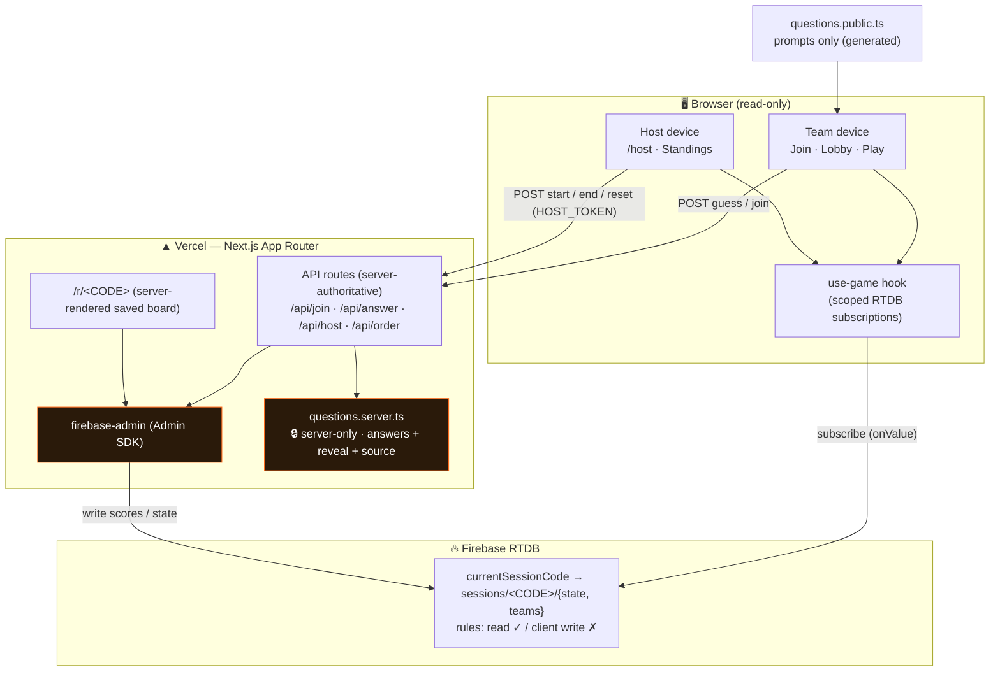
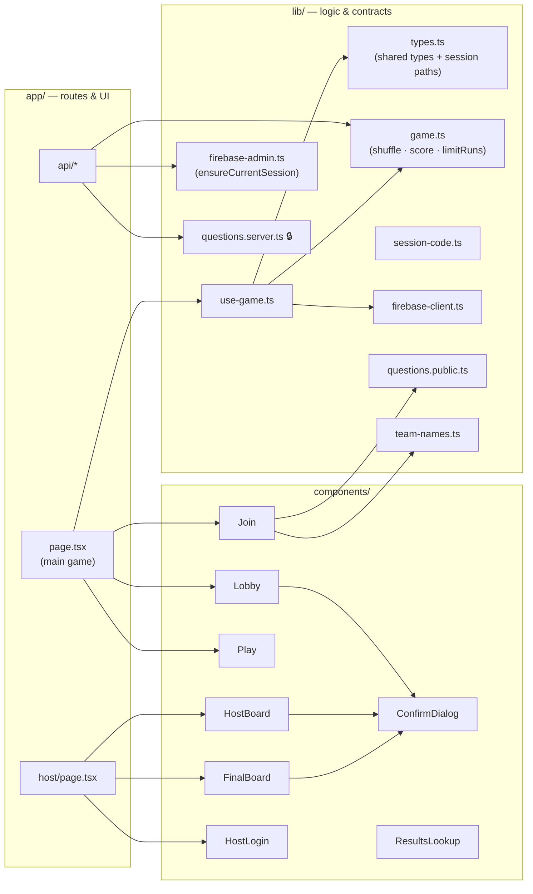

# Spot the Bot

[](https://github.com/JusLarsen/spot-the-bot/actions/workflows/ci.yml)

A live, team-based **human-vs-AI** detection game for leadership sessions and events.
Built as a training tool: a room of teams reads short text samples and decides, together,
whether each was written by a person or generated by an AI — learning the tells as they go.

> Live: **[spot-the-bot-psi.vercel.app](https://spot-the-bot-psi.vercel.app)**

## How it works

Each table grabs one device and picks a team name. Every team works through its own
shuffled bank of 148 text samples — for each one the group decides **human** or **AI**.
The host starts a single shared countdown for the whole room (host picks the length at
start — 5, 10, or 15 min; default 10). When time runs out, the team with the most correct
answers wins; ties break by least total answer time, so there's one clean trophy winner.
Latecomers can **jump into a round already in progress** (until the final 60 seconds), and
every game's leaderboard is **saved under a short code** — revisit it any time at `/r/<CODE>`
(the host's final screen shows a QR to it).

It's a **training** game first: most AI samples deliberately show common AI tells (hedging,
listy parallelism, hollow uplift) so teams learn to spot them. A minority are flagged
`sneaky` — when a team misses one of those, the reveal reassures rather than scolds.

The host is a **facilitator, not a contestant**. The host device shows live standings and
the Start / End / Reset controls, and never appears on the leaderboard.

## Question bank

148 samples across 5 categories, each mixing authentic human quotes with AI imitations:

| Category   | Count | Source flavor                                 |
| ---------- | ----- | --------------------------------------------- |
| `movies`   | 48    | Star Wars / Avengers / Spaceballs lines       |
| `bbq`      | 38    | Traeger influencers (Diva Q, Matt Pittman, …) |
| `business` | 22    | Business-book quotes                          |
| `disney`   | 24    | Famous + obscure Disney/Pixar lines           |
| `speech`   | 16    | Famous / funny speeches                       |

## Architecture



**The security boundary is the server, not the browser.** Clients only ever _read_ RTDB;
every write goes through a Next.js API route using the Firebase Admin SDK. RTDB rules deny
all client writes. Answers never reach the browser until the guess is in.

### Component layers



### Game flow

```mermaid
sequenceDiagram
    participant T as Team device
    participant API as Next.js API
    participant DB as RTDB

    T->>API: POST /api/join (team name)
    API->>DB: ensure session, create sessions/&lt;CODE&gt;/teams/&lt;id&gt;
    API-->>T: { teamId, sessionId }
    Note over T: stb_role / stb_team (incl. sessionId) saved to localStorage
    Note over T,DB: Host: POST /api/host {start} → sessions/&lt;CODE&gt;/state = live, endsAt set
    T->>API: GET /api/order?teamId=
    API-->>T: deterministic, run-capped question id list
    loop each sample (self-paced)
        T->>API: POST /api/answer (sessionId, id, guess)
        API->>DB: update sessions/&lt;CODE&gt;/teams/&lt;id&gt; score
        API-->>T: truth + reveal + source (+ sneaky flag)
    end
    Note over DB: End → phase: ended; session node is the saved board at /r/&lt;CODE&gt;
```

**Sessions & phases**: a run of the game is a session keyed by its short **code**, stored at
`sessions/<CODE>/state` (`{phase: 'lobby'|'live'|'ended', startedAt, endsAt, version, code}`)
and `sessions/<CODE>/teams/<id>`. A root `currentSessionCode` pointer names the active session;
the single-session client follows it (it never types a code). During `live`, every team plays
self-paced through its own deterministic shuffle — no per-round host sync, just the one shared
clock (`endsAt - startedAt`). **Reset mints a new session and repoints**, leaving old sessions
intact (so their `/r/<CODE>` boards persist). Multi-session + join codes later are purely
additive — read the code from the URL instead of the pointer.

### Why per-team order is computed server-side

The client never sees which samples are AI, so it can't prevent long same-answer streaks.
`/api/order?teamId=` returns a shuffle seeded by team ID (so a reload resumes the same order)
with same-answer runs capped at 3 (`limitRuns` in `lib/game.ts`) — no "it's been a bot six
times, must be human" meta-gaming.

### Scoped subscriptions (keeps a full room linear)

Team devices subscribe to the `currentSessionCode` pointer + `sessions/<CODE>/state` + their
own `sessions/<CODE>/teams/<id>` during play, and to all of the session's teams only in
lobby/ended; the host subscribes to all teams. This keeps RTDB fan-out O(N) instead of O(N²)
— load-tested at 30 concurrent connections.

## Key invariants

- **Host is never a contestant** — unlocking host mode deletes any team this device made.
- **Answers never reach the client before the guess** — `questions.server.ts` is
  `import "server-only"`; the build fails if it leaks into client code.
- **Clients never write to RTDB** — all writes go through server API routes + Admin SDK.
- **Session data uses native nested paths** — `sessions/<code>/state`, `sessions/<code>/teams/<id>`
  (no `:`, so no encoding); the legacy `:` → `__` swap only ever applied to old flat keys.
- **Reset never deletes old sessions** — it mints a new one and repoints `currentSessionCode`, so
  saved `/r/<CODE>` leaderboards survive.
- **Leaderboard rows use React text rendering, never `innerHTML`** — team names are
  user-supplied; string-concatenated HTML would be an injection vector.
- **Session identity persists in `localStorage`** (`stb_role` / `stb_team` incl. `sessionId`) so a
  dropped phone rejoins the same team instead of spawning a duplicate.

## Local development

```bash
cp .env.example .env.local   # fill in all values (see table below)
npm install
npm run dev                  # http://localhost:3000
```

## Environment variables

| Variable                            | Visibility           | Description                                                                                 |
| ----------------------------------- | -------------------- | ------------------------------------------------------------------------------------------- |
| `NEXT_PUBLIC_FIREBASE_API_KEY`      | Public (browser)     | Firebase web API key                                                                        |
| `NEXT_PUBLIC_FIREBASE_AUTH_DOMAIN`  | Public (browser)     | Firebase auth domain                                                                        |
| `NEXT_PUBLIC_FIREBASE_DATABASE_URL` | Public (browser+srv) | RTDB URL (also used by Admin SDK)                                                           |
| `NEXT_PUBLIC_FIREBASE_PROJECT_ID`   | Public (browser)     | Firebase project ID                                                                         |
| `NEXT_PUBLIC_FIREBASE_APP_ID`       | Public (browser)     | Firebase web app ID                                                                         |
| `FIREBASE_SERVICE_ACCOUNT`          | Secret (server only) | Full service account JSON, single-line or base64-encoded. Admin SDK credential.             |
| `HOST_TOKEN`                        | Secret (server only) | Passphrase for host controls (Start / End / Reset). Checked server-side on every host call. |

`NEXT_PUBLIC_*` values are Firebase's public client identifiers by design — safe to expose.
The real security boundary is the RTDB rules and server routes, not key secrecy.

## Firebase setup

1. Create a Firebase project and enable **Realtime Database**.
2. Publish the database rules (read ✓, client write ✗ — all writes go through the server
   Admin SDK):

   ```sh
   npx firebase-tools login   # once
   npm run deploy:rules       # pushes database.rules.json to the project in .firebaserc
   ```

   You can also paste `database.rules.json` by hand into **Realtime Database → Rules**.

3. **Project settings → Service accounts → Generate new private key** → paste the entire
   JSON (single-line or base64) into `FIREBASE_SERVICE_ACCOUNT`.
4. **Project settings → Your apps → Web app → SDK config** → copy the `NEXT_PUBLIC_FIREBASE_*`
   values.

### Rules drift — check before every live session

The rules are **not deployed by CI**. They live in the Firebase console, so they can drift
from `database.rules.json`, and Firebase's default "test mode" rules **expire after 30 days**.
When that happens every client read returns `permission_denied`, every device shows
**"Can't connect"**, and nothing in the app logs looks wrong — the server API routes keep
working, because the Admin SDK bypasses rules.

```sh
npm run check:rules   # exit 0 = clients can read; exit 1 = rules are blocking
```

If it fails, run `npm run deploy:rules`. No redeploy is needed — clients recover on reload.

## Deploy to Vercel

1. Set all env vars in the Vercel dashboard (Settings → Environment Variables). Mark
   `FIREBASE_SERVICE_ACCOUNT` and `HOST_TOKEN` as secrets.
2. Push to `main` → **production** deploy; any other branch → **preview** deploy.
3. Run **Reset game** (host control) before a live session to clear practice scores.

## Scripts

| Command                 | Description                                                          |
| ----------------------- | -------------------------------------------------------------------- |
| `npm run dev`           | Start Next.js dev server                                             |
| `npm run build`         | Production build                                                     |
| `npm run lint`          | ESLint                                                               |
| `npm run typecheck`     | TypeScript type check (`tsc --noEmit`)                               |
| `npm run test`          | Vitest (single run)                                                  |
| `npm run test:watch`    | Vitest in watch mode                                                 |
| `npm run gen:questions` | Regenerate `lib/questions.public.ts` from the server question bank   |
| `npm run check:rules`   | Verify the live RTDB still allows client reads (run before an event) |
| `npm run deploy:rules`  | Publish `database.rules.json` to Firebase                            |

## Testing

Pure game logic in `lib/game.ts` (shuffle, scoring, `limitRuns`) and `lib/team-names.ts`
are covered by [Vitest](https://vitest.dev/) unit tests.

```bash
npm run test
```

## Tech stack

Next.js 16 (App Router) · React 19 · TypeScript · Tailwind v4 · Firebase Realtime Database
(client SDK + Admin SDK) · deployed on Vercel.
